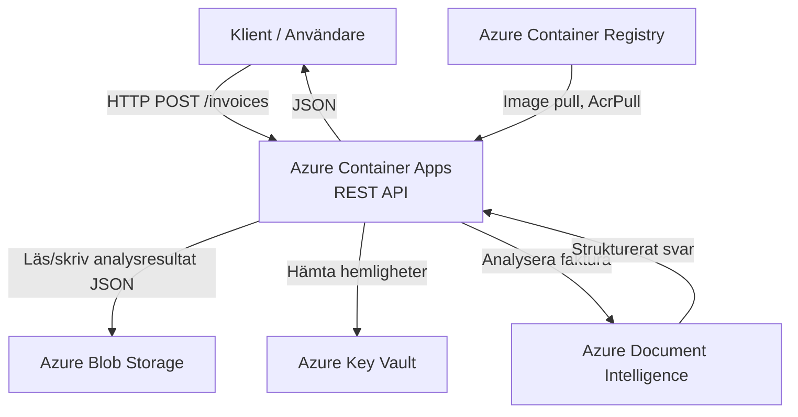

# Teknisk leveransrapport

**Uppdrag:** Scanly AB — Fakturaigenkänning som tjänst  
**Konsultteam:** [Fyll i era namn här]  
**Datum:** 2026-09-30  
**Version:** 1.1  

## Sammanfattning
Vi har levererat en fungerande, molnbaserad plattform för automatisk fakturaigenkänning. Kunden laddar upp en faktura (PDF eller bild) via ett REST API och hämtar därefter strukturerad data — leverantör, totalbelopp, förfallodatum och valuta — utan manuell handpåläggning. Plattformen är driftsatt i Microsoft Azure med infrastruktur som kod (Bicep), verifierad med automatiserade tester och byggd på Azure Container Apps som kan skala upp och ned efter belastning.

Två punkter återstår innan skarp kundlansering: autentisering för slutanvändare och rate limiting (se *Utanför leveransens scope* och *Kvarvarande risker*).

## Vad som levereras

### Inkluderat i leveransen
| Komponent | Teknisk lösning | Status |
| :--- | :--- | :--- |
| **REST API** | .NET 10 Minimal APIs, 4 endpoints (se nedan) | ✅ Levererat |
| **API-dokumentation** | OpenAPI + Scalar UI (`/scalar/v1`) | ✅ Levererat |
| **Automatiserade tester** | 10 xUnit-integrationstester (`[Fact]`, `WebApplicationFactory`) | ✅ Levererat |
| **Felhantering** | Filvalidering (typ, storlek, tom fil), 429 → 503, övriga Azure-fel → 502, global felhanterare med JSON-svar | ✅ Levererat |
| **Containerisering** | Docker, multi-stage build (SDK → ASP.NET runtime) | ✅ Levererat |
| **Driftsättning** | Azure Container Apps | ✅ Levererat |
| **Bildarkiv** | Azure Container Registry (Basic) | ✅ Levererat |
| **Lagring av analysresultat** | Azure Blob Storage | ✅ Levererat |
| **AI-analys** | Azure Document Intelligence (`prebuilt-invoice`) | ✅ Levererat |
| **Hemlighetshantering** | Azure Key Vault | ✅ Levererat |
| **Infrastruktur som kod** | Bicep med parameterfiler för dev/test/prod | ✅ Levererat |
| **Automatiserad driftsättning** | GitHub Actions: checkout → Azure login → ACR login → build → push → uppdatera Container App | ✅ Levererat |

### API i korthet
| Endpoint | Funktion |
| :--- | :--- |
| `GET /health` | Hälsokontroll, returnerar status och läge (`azure` eller `demo`) |
| `POST /invoices` | Tar emot en fil (`multipart/form-data`, fält `file`, max 10 MB), analyserar den och returnerar `201 Created` med ett id |
| `GET /invoices/{id}` | Hämtar det strukturerade analysresultatet |
| `GET /invoices` | Listar id:n för analyserade fakturor |

Uppladdning och hämtning är två separata anrop: `POST` returnerar id och status, och resultatet hämtas med `GET /invoices/{id}`. Om Azure-inställningarna saknas startar API:et i demo-läge med mock-svar, vilket används i de automatiska testerna.

### Utanför leveransens scope
Följande punkter identifierades under uppdraget men ingår inte i denna leverans. De rekommenderas som nästa steg.

| Punkt | Motivering |
| :--- | :--- |
| **Autentisering för slutanvändare** | Kräver Entra ID-integration och definierade användarroller. Rekommenderas starkt inför skarp kundlansering. |
| **Rate limiting** | Skydd mot överbelastning (DDoS eller spam-anrop). Bör läggas till via API Management eller i koden innan lansering. |

## Arkitektur

### Systemdiagram

### Motiverade arkitekturval

**Varför Azure Container Apps och inte AKS?**
Container Apps hanterar skalning och underliggande infrastruktur automatiskt, vilket minskar driftkostnaden och komplexiteten avsevärt för ett tidigt SaaS-bolag. Dev-miljön kan skala till noll när den inte används. AKS ger mer finkornig kontroll men kräver ett dedikerat driftteam — ett omotiverat overhead i den här fasen.

**Varför Bicep och inte manuell konfiguration?**
Med Bicep får vi spårbarhet, reproducerbarhet och idempotens. Parameterfilerna (`dev.bicepparam`, `test.bicepparam`, `prod.bicepparam`) gör att samma mall driftsätter alla tre miljöer med olika dimensionering, utan manuella steg i Azure-portalen:

| Miljö | Repliker (min) | CPU / minne | Lagring |
| :--- | :--- | :--- | :--- |
| dev | 0 (scale-to-zero) | 0,25 vCPU / 0,5 Gi | LRS |
| test | 1 | 0,5 vCPU / 1 Gi | LRS |
| prod | 3 | 0,5 vCPU / 1 Gi | GRS |

**Varför Azure Blob Storage?**
Blob Storage är ett mycket kostnadseffektivt sätt att spara analysresultaten (små JSON-filer) med hög tillgänglighet. Det integrerar dessutom med Managed Identity, vilket gör att appen kan nå lagringen utan nycklar.

## Säkerhetsarkitektur

### Identitet och åtkomst
| Resurs | Åtkomstkontroll |
| :--- | :--- |
| **Azure Container Apps** | System Assigned Managed Identity — inga lösenord i koden. |
| **Azure Container Registry** | RBAC via Managed Identity (AcrPull). |
| **Azure Blob Storage** | RBAC via Managed Identity (Storage Blob Data Contributor). |
| **Azure Key Vault** | Access policy för Container Appens Managed Identity (endast `get` och `list` på hemligheter). |
| **Azure Document Intelligence** | API-nyckel som lagras i Key Vault och läses av appen. Koden stöder även Managed Identity som reservväg (se *Kvarvarande risker*). |

### Hemlighetshantering
Inga credentials eller connection strings finns i källkod eller git-historik. Document Intelligence-endpoint och -nyckel skickas som `@secure`-parametrar till Bicep-driftsättningen (från pipeline-secrets), sparas i Key Vault och hämtas av Container Appen via Key Vault-referenser med appens Managed Identity. Byggartefakter (`bin/` och `obj/`) exkluderas via `.gitignore`.

## Genomförande och utmaningar
Under projektet löste vi bland annat följande:
1. **Managed Identity före behörigheter:** Container Appens identitet finns först när appen är skapad, men Key Vault-referenser och rolltilldelningar kräver identiteten. Vi löste det i två steg i `main.bicep`: appen skapas först, rollerna (AcrPull och Blob Data Contributor) och Key Vault-åtkomsten tilldelas, och därefter uppdateras appen med hemligheterna.
2. **Robust felhantering mot Azure-tjänsten:** Document Intelligence kan svara med 429 vid hög belastning. API:et översätter det till 503 med ett begripligt meddelande, medan övriga Azure-fel ger 502 och oväntade fel fångas av en global felhanterare som returnerar JSON i stället för en HTML-stacktrace.
3. **Git och byggartefakter:** Lokala testkörningar skapade temporära filer i projektet. Vi höll git-historiken ren genom att exkludera `bin/`- och `obj/`-mappar.
4. **Strukturering av tester:** Vi satte upp `[Fact]`-baserade xUnit-tester som verifierar att API:et returnerar förväntade statuskoder och data, så att fel fångas lokalt innan koden når molnet.

### Teständring
De 10 testerna körs i demo-läge utan Azure-uppkoppling och täcker validering, statuskoder och flödet POST → GET. Anropen mot Document Intelligence och Blob Storage (inklusive 429-hanteringen och tolkningen av fakturafälten) är inte täckta av automatiska tester i dag.

## Kvarvarande risker
| Risk | Sannolikhet | Åtgärd |
| :--- | :--- | :--- |
| **API saknar autentisering** | Hög | Implementera Entra ID Easy Auth i nästa sprint. |
| **Ingen rate limiting på POST-endpoint** | Medel | Lägg till API Management eller throttling-regler i .NET. |
| **Document Intelligence använder API-nyckel** | Medel | Byt till Managed Identity (rollen *Cognitive Services User*). Koden stöder det redan när nyckeln utelämnas. |
| **Admin-användare aktiverad på ACR** | Medel | Stäng av `adminUserEnabled`, eftersom Container Appen hämtar images via Managed Identity. |
| **Azure-anrop saknar automatiska tester** | Medel | Lägg till enhetstester med mockade klienter för 429-fallet och `ParseFaktura`. |

## Kostnadskalkyl
*(Beräknat för en lanseringsvolym med **30 kunder**, baserat på vår Azure Infrastruktur Kostnadskalkyl nedskalad från 200 kunder. Region West Europe.)*

| Tjänst | Konfiguration / Beskrivning | Estimerad månadskostnad (SEK) |
| :--- | :--- | :--- |
| **Azure Container Apps** | Consumption Plan, ~60 000 anrop, 3 min-replikor | ~375.00 kr |
| **Azure Container Registry** | Basic Tier | 57.10 kr |
| **Storage Accounts** | Block Blob Storage, ZRS, låg lagring | ~5.00 kr |
| **Key Vault** | ~15 000 operationer | ~0.50 kr |
| **Azure Document Intelligence**| S0-instans: 15 000 Pre-built sidor | 1 427.88 kr |
| **Totalt** | | **~1 865.48 kr** |

Container Apps-kostnaden är i princip fast, eftersom tre repliker alltid är igång. Den rörliga kostnaden är Document Intelligence, som kostar ca 0,20 kr per analyserad faktura på 2 sidor. Log Analytics (loggar från Container Apps) bedöms rymmas inom gratisgränsen vid denna volym. Till jämförelse blir test-miljön (en replika) ca 120 kr/mån i beräkningskostnad, och dev-miljön nära 0 kr tack vare scale-to-zero.

### Skalningspunkt
Om trafiken ökar markant är den primära flaskhalsen **Azure Document Intelligence**, eftersom S0-nivån har begränsningar för antal anrop per sekund (rate limits). När gränsen nås svarar API:et med 503 (översatt från Azures 429) i stället för att krascha. Åtgärden är att skala upp Document Intelligence eller köa analyserna. På Container App-sidan sätter Bicep i dag bara `minReplicas`, så en explicit HTTP-skalningsregel (t.ex. antal samtidiga anrop) och en `maxReplicas` bör läggas till.

## Rekommendationer inför produktionssättning
* **Autentisering:** Implementera Entra ID (Easy Auth) innan offentlig lansering.
* **Managed Identity överallt:** Byt Document Intelligence från API-nyckel till Managed Identity och stäng av admin-användaren på ACR.
* **Monitoring:** Koppla på Azure Application Insights och sätt upp en alert om felfrekvensen överstiger 5 % eller om API-svarstiden överstiger 2 sekunder.
* **Loggning:** Logga Azure-fel (429/502) i API:et så att de syns i Application Insights.
* **Tester i pipeline:** Kör `dotnet test` som ett steg före bygget så att ingen kod deployas utan gröna tester.
* **Kostnadslarm:** Sätt en budget-alert i Azure Cost Management på t.ex. 80 % av den budgeterade månadskostnaden.

## Överlämning
| Leverabel | Plats |
| :--- | :--- |
| **Källkod** | [Länk till ert repo] |
| **Bicep-mallar** | `/bicep/`-mappen i repot |
| **Pipeline-definition** | `.github/workflows/bicep.yaml` |
| **API-dokumentation** | `/scalar/v1` när API:et körs |
| **Denna rapport** | `RAPPORT.md` i repots rot |

*Rapporten är upprättad av konsultteamet som ett avslutande leveransdokument.*

